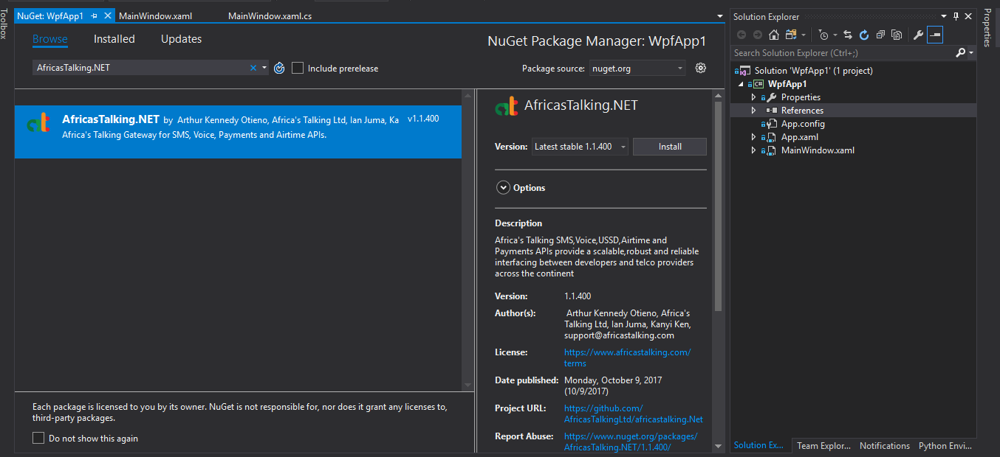
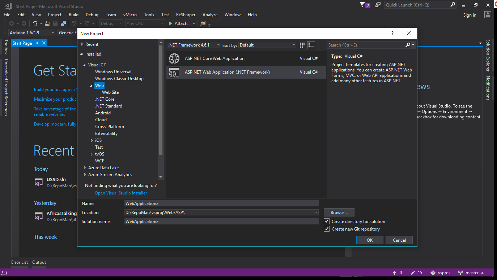
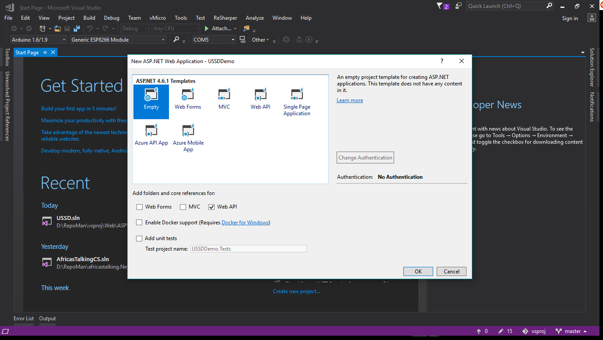
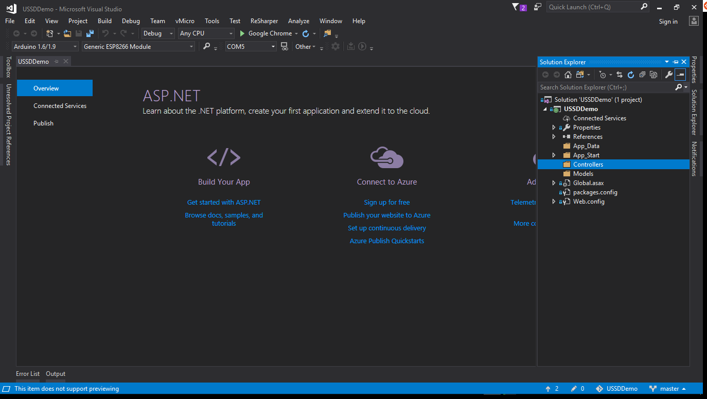
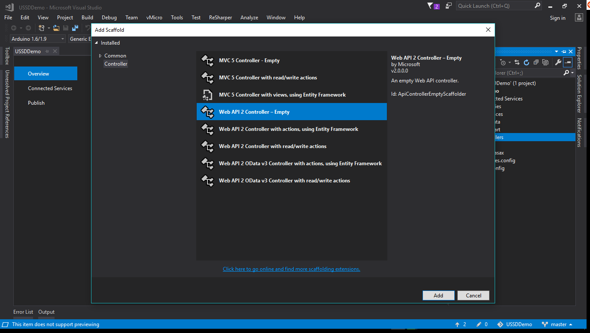
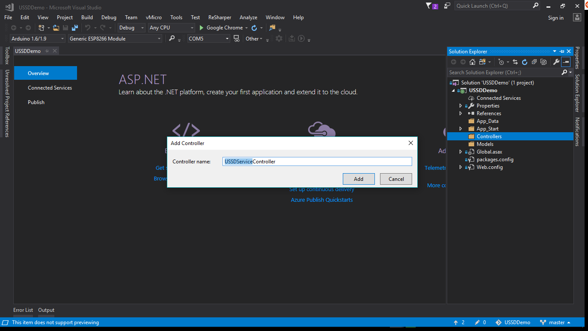
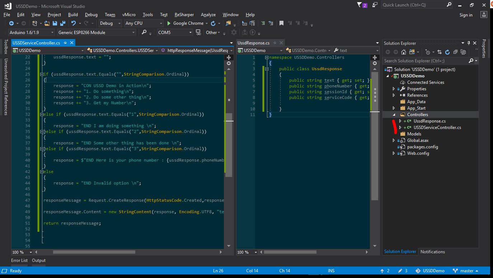
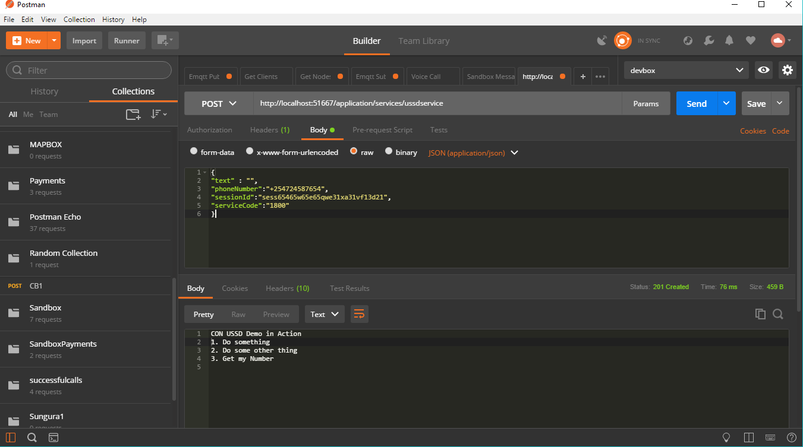

# Official Africa's Talking C# API wrapper [](https://ci.appveyor.com/project/TheBeachMaster/africastalking-net) [](https://www.nuget.org/packages/AfricasTalking.NET/)

The Africa's Talking C# API wrapper provides convenient access to the Africa's Talking API from applications written in C#. With support for .NET45, .NET46 and .NET Standard 2.0. 

## Documentation 
Take a look at the [API docs here](http://docs.africastalking.com/) for more information. 

## Installation Options
1. #### Using Visual Studio IDE

+ On a new project, Navigate to the ***Solution Explorer*** tab within Visual Studio. 
+ Right-click on the ***References*** node and click on the *Manage Nuget Packages* from the resulting context menu. 
+ On the Nuget Package Manager window navigate to the ***Browse*** Tab. 
+ Key in **AfricasTalking.NET** and select version _1.1.700_ or higher. 
+ Click on the ***Install*** button and accept the licences to proceed. 

> For .NET Standard 2.0 projects yellow triangles may appear on your solution items,note that these are warnings due to deprecated support for some packages used by the wrapper.These will be reviewed in future releases,for now they will not affect the functionality of your project and can be safely ignored.Should there be a case where this package breaks your project kindly report the package via Nuget. 
>
> For more info on this follow [this thread](https://github.com/aspnet/Mvc/issues/5822) and [this link](https://dotnet.myget.org/feed/aspnetwebstack-dev/package/nuget/Microsoft.AspNet.WebApi.Client) .

 


2. #### Using .NET CLI 

+ From the _command prompt/powershell window_ opened in your project directory, key in the following and press *Enter*. 
```powershell 
 dotnet add package AfricasTalking.NET --version 1.1.700
```
> Ensure you have the latest version of the package. Visit [Nuget](https://www.nuget.org/packages/AfricasTalking.NET/) for more info on the latest release of this package. 

3. #### Using Nuget Package Manger Console 

+ On your Nuget package manager console,key in the following and press *Enter* 
```powershell 
Install-Package AfricasTalking.NET -Version 1.1.700 
```
> Ensure you have the latest version of the package. Visit [Nuget](https://www.nuget.org/packages/AfricasTalking.NET/) for more info on the latest release of this package

## Usage 

+ To use this package ensure you add the following `using` statement to your project file: 
```csharp 
 using AfricasTalkingCS;
```

The package needs to be configured with your Africa's Talking username and API key (which you can get from the dashboard). 

```csharp  

 const string username = "sandbox"; // substitute with your username if mot using sandbox
 const string apikey = "mySandboxKey"; // substitute with your production API key if not using sandbox

```


```csharp  

 var gateway = new AfricasTalkingGateway(username, apiKey);
  
```
> Important:

 If you register a callback URL with the API, always remember to acknowledge the receipt of any data it sends by responding with an HTTP `200`;  [Here's a sample application you can use to test a call-back url](https://github.com/TheBeachMaster/ATSamples/tree/master/paymentcallback.node) 
> For example in an ASP.NET Core or ASP.NET MVC Project

```csharp 
[HttpPost]
public ActionResult SomeCoolMethod(awesome, params)
{
   // Your awesome logic

   //If not using MVC5
   return new HttpStatusCodeResult(200);

   //If using MVC5
   return new HttpStatusCodeResult(HttpStatusCode.OK);  // OK = 200
} 
```

### SMS 
```csharp 
            try
            {
                var sms = gateway.SendMessage(recepients, msg);
                foreach (var res in sms["SMSMessageData"]["Recipients"])
                {
                    Console.WriteLine((string)res["number"] + ": ");
                    Console.WriteLine((string)res["status"] + ": ");
                    Console.WriteLine((string)res["messageId"] + ": ");
                    Console.WriteLine((string)res["cost"] + ": ");
                }
            }
            catch (AfricasTalkingGatewayException exception)
            {
                Console.WriteLine(exception);
            }
```

#### [Sending SMS](http://docs.africastalking.com/sms/sending) 

- `SendMessage(to,message,from,bulkSmsMode,options)` :  The following arguments are supplied to facilitate sending of messages via our APIs  

    - `to` : The recipient(s) expecting the message 
    - `message` : The SMS body. 
    - `from` :  (`Optional`) The Short-code or Alphanumeric ID that is associated with an Africa's Talking account.  
    - `bulkSmsMode` (`Optional`) : This parameter will be used by the Mobile Service Provider to determine who gets  billed for a message sent using a Mobile-Terminated Short-code. Must be set to  *1*  for Bulk SMS. .
    - `options` :   (`Optional`). Passed as _key-value_ pairs 
        -   `enque` : This parameter is used for Bulk SMS clients that would like deliver as many messages to the API before waiting for an Ack from the Telcos. If enabled, the API will store the messages in its databases and send them out asynchronously after responding to the request 
        -   `keyword` : This parameter is used for premium services. It is essential for subscription premium services.
        -   `linkId` : This parameter is used for premium services to send OnDemand messages. We forward the linkId to your application when the user send a message to your service. (Essential for premium subscription services) 
        -   `retryDurationInHours` : This parameter is used for premium messages. It specifies the number of hours your subscription message should be retried in case it's not delivered to the subscriber. (Essential for premium subscription services)

    ​

#### [Retrieving SMS](http://docs.africastalking.com/sms/fetchmessages)

> You can register a callback URL with us and we will forward any messages that are sent to your account the moment they arrive. 
> [Read more](http://docs.africastalking.com/sms/callback)

- `FetchMessages(lastReceivedId)` : Manually retrieve your messages.

    - `lastReceivedId` : This is the id of the message that you last processed. If this is your first call, pass in 0. `REQUIRED`


#### [Premium Subscriptions](http://docs.africastalking.com/subscriptions/create)

- `CreateSubscription(phoneNumber,shortCode,keyWord,checkoutToken)`:

    - `shortCode` : This is a premium short code mapped to your account `REQUIRED`
    - `keyWord` : Value is a premium keyword under the above short code and mapped to your account. `REQUIRED`
    - `phoneNumber`: The phoneNumber to be subscribed `REQUIRED`
    - `checkoutToken` :  This is a token used to validate the subscription request  `REQUIRED` 

     > If you have subscription products on your premium SMS short codes, you will need to configure a callback URL that we will invoke to notify you when users subscribe or unsubscribe from your products (currently supported on Safaricom).Visit [this link](http://docs.africastalking.com/subscriptions/callback) to learn more on how to setup a subscription callback  


> Example    - Creating Checkout Token

```c#
            var username = "sandbox";
            var apikey = "KEY";
            var gateway = new AfricasTalkingGateway(username, apikey);
            var phoneNum = "+254XXXXXXXXX"; // Ensure the phonenumber is properly formatted
            try
            {
                var token = gateway.CreateCheckoutToken(phoneNumber);
                Console.WriteLine("Your Token is:  " + token);
            }
            catch (AfricasTalkingGatewayException e)
            {
                Console.WriteLine("Yikes: " + e.StackTrace + ". " + e.Message);
            }
```

> Example    - Creating Premium SMS subscription

```c#
            var username = "sandbox";
            var apikey = "KEY";
            var gateway = new AfricasTalkingGateway(username, apikey);
            var shortCode = "NNNNN";
            var keyword = "keyword";
            var phoneNum = "+254XXXXXXXXX";
            var token = "Token";
            try
            {
                var response = gateway.CreateSubscription(phoneNum, shortCode, keyword, token);
                Console.WriteLine(response);
            }
            catch (AfricasTalkingGatewayException e)
            {
                Console.WriteLine("We hit a snag: " + e.StackTrace + ". " + e.Message);
                throw;
            }
```

> Example -Sending Premium SMS

```c#
            var username = "sandbox";
            var apikey = "KEY";
            var gateway = new AfricasTalkingGateway(username, apikey);
            var opts = new Hashtable { ["keyword"] = "mykeyword" }; // ....
            var from = "NNNNN";
            var to = "+2547XXXXX,+2547XXXXY";
            var message = "Super Cool Message";
            try
            {
                var res = gateway.SendMessage(to, message, from, 1, opts); // Set Bulk to true
                Console.WriteLine(res);
            }
            catch (AfricasTalkingGatewayException e)
            {
                Console.WriteLine("Whoops: " + e.Message);
                throw;
            }
```


### [Airtime](http://docs.africastalking.com/airtime/sending)

```csharp
var airtimeTransaction = gateway.SendAirtime(airtimerecipients);
```
- `SendAirtime(recipients)`: 
    - `recipients`: Contains JSON objects containing the following keys
        - `phoneNumber`: Recipient of airtime
        - `amount`: Amount sent `>= 10 && <= 10K` with currency e.g `KES 100`


```csharp

            var username = "sandbox";
            var apikey = "MyAPIKEY";
            var airtimerecipients = @"{'phoneNumber':'+254XXXXXXXX','amount':'KES 250'}"; // Send any JSON object of n-Length
            var gateway = new AfricasTalkingGateway(username, apikey);
            try
            {
                var airtimeTransaction = gateway.SendAirtime(airtimerecipients);
                Console.WriteLine(airtimeTransaction);
            }
            catch (AfricasTalkingGatewayException e)
            {
                Console.WriteLine("We ran into issues: " + e.StackTrace + ": " + e.Message);
            }
```

### [Payments](http://docs.africastalking.com/payments)

> Mobile Consumer To Business (C2B) functionality allows your application to receive payments that are initiated by a mobile subscriber.
> This is typically achieved by disctributing a PayBill or BuyGoods number (and optionally an account number) that clients can use to make payments from their mobile devices.
> [Read more](http://docs.africastalking.com/payments/mobile-c2b)


#### [Checkout](http://docs.africastalking.com/payments/mobile-checkout)

- `Checkout(productName,phoneNumber,currencyCode,amount,providerChannel,metadata)` :  Initiate Customer to Business (C2B) payments on a mobile subscriber's device. [More info](http://docs.africastalking.com/payments/mobile-checkout)

    - `productName`: Your Payment Product. `REQUIRED`

    - `phoneNumber`: The customer phone number (in international format; e.g. `+25471xxxxxxx`). `REQUIRED`

    - `currencyCode`: 3-digit ISO format currency code (e.g `KES`, `USD`, `UGX` etc.) `REQUIRED`

    - `amount`: This is the amount. `REQUIRED`

    - `providerChannel`: Default provider channel details.For example `MPESA` or `Athena` for sandbox. 
      - **(Sandbox) :**  Note that for sandbox you'll have to manually create a channel that will be associated with `Athena`. This is the channel name that you will pass as an argument during a checkout.  Example after creating a channel you will have `Athena:channel_name` , pass `channel_name ` as the  _providerChannel_ . 

        ​

    - `metadata` : This value contains a map of any metadata that you would like us to associate with this request. You can use this field to send data that will map notifications to checkout requests, since we will include it when we send notifications once the checkout is complete. `(Optional)`

      ​

 > Example 
 ```csharp 
            var username = "sandbox";
            var apiKey = "";
            var productName = "coolproduct";
            var phoneNumber = "+254XXXXXXX";
            var currency = "KES";
            int amount = 35700;
            var channel = "mychannel";
    		var metadata = new Dictionary<string, string>
            {
                { "reason", "stuff" }
            };

            var gateway = new AfricasTalkingGateway(username, apiKey);

            try
            {
                var checkout = gateway.Checkout(productName, phoneNumber, currency, amount, channel, metadata);
                Console.WriteLine(checkout);
            }
            catch (AfricasTalkingGatewayException e)
            {
                Console.WriteLine("We ran into problems: " + e.Message);
            } 
 ```

#### [B2C](http://docs.africastalking.com/payments/mobile-b2c)


- `MobileB2C(productName,recepients)`:  Initiate payments to mobile subscribers from your payment wallet. [More info](http://docs.africastalking.com/payments/mobile-b2c)

    - `productName`: Your Payment Product. `REQUIRED`

    - `recipients`: A list of **up to 10** recipients info and metadata. Each recipient has:

        - `phoneNumber`: The payee phone number (in international format; e.g. `+25471xxxxxxx`). `REQUIRED`

        - `currencyCode`: 3-digit ISO format currency code (e.g `KES`, `USD`, `UGX` etc.) `REQUIRED`

        - `amount`: Payment amount. `REQUIRED`

        - `metadata`: Some optional data to associate with transaction. 

> Example 

```csharp  
 // Suppose a superhero unknowingly paid for a suit they did not like,and we want to refund them
            // or you want to pay your employees,staff etc...
            // Note::
            /*
             * Remember: In a live account ensure you have registered a credible B2C product and a callback url else these transactions will fail
             */

            // Developer Details
            string username = "sandbox";
            string apiKey = "apikey";
            string productName = "coolproduct";
            string currencyCode = "KES";

            // Recepient details,these can be retrieved from a db..or somewhere else then parsed...we'll keep it simple
            string hero1PhoneNum = "+254xxxxxxx";
            string hero2PhoneNum = "+254xxxxxxx";
            string hero1Name = "Batman";
            string hero2Name = "Superman";
            decimal hero1amount = 15000M;
            decimal hero2amount = 54000M;

            // We invoke our gateway
            var gateway = new AfricasTalkingGateway(username, apiKey);

            // Let's create a bunch of people who'll be receiving the refund or monthly salary etc...
            var hero1 = new MobileB2CRecepient(hero1Name, hero1PhoneNum, currencyCode, hero1amount);

            // we can add metadata...like why we're paying them/refunding them etc...
            hero1.AddMetadata("reason", "Torn Suit");
            var hero2 = new MobileB2CRecepient(hero2Name, hero2PhoneNum, currencyCode, hero2amount);
            hero2.AddMetadata("reason", "Itchy Suit");

            // ....etc

            // Next we create a recepients list
            IList<MobileB2CRecepient> heroes = new List<MobileB2CRecepient>
            {
                hero1,
                hero2
            };

            // let's refund them so that they can keep saving the planet
            try
            {
                var response = gateway.MobileB2C(productName, heroes);
                Console.WriteLine(heroes);
                Console.WriteLine(response);
            }
            catch (AfricasTalkingGatewayException e)
            {
                Console.WriteLine("We ran into problems: " + e.StackTrace + e.Message);
            }
            Console.ReadLine();
        }
```


#### [B2B](http://docs.africastalking.com/payments/mobile-b2b)


- `MobileB2B(product,providerChannel,transfer,currency,transferAmount,channelReceiving,accountReceiving,b2Bmetadata)` :  Mobile Business To Business (B2B) APIs allow you to initiate payments TO businesses eg banks FROM your payment wallet. [More info](http://docs.africastalking.com/payments/mobile-b2b) 

    - `product` :  Your Payment Product as setup on your account. `REQUIRED`   
    - `providerChannel` :  This contains the payment provider that is facilitating this transaction.`REQUIRED` 
       Supported providers at the moment are:  

    ​         

    ```c#
    string provider = "Athena";
    // or 
    string provider = "MPESA";
    ```

    ​

    - `transfer`: This is the transfer type for the transaction: `REQUIRED`  

      ```c#
      string transferType = "BusinessToBusinessTransfer";
                   // Transfer Types
                   /**
                    * BusinessBuyGoods
                    * BusinessPayBill
                    * DisburseFundsToBusiness
                    * BusinessToBusinessTransfer
                    */
      ```

      ​

    - `currency`: 3-digit ISO format currency code (e.g `KES`, `USD`, `UGX` etc.) `REQUIRED`

    - `channelReceiving`: This value contains the name or number of the channel that will receive payment by the provider. `REQUIRED`

    - `accountReceiving`: This value contains the account name used by the business to receive money on the provided destinationChannel. `REQUIRED`

    - `transferAmount`: Payment amount. `REQUIRED`

    - `b2Bmetadata`: Some optional data to associate with transaction. `REQUIRED`   


> Example 
```c# 
// Suppose we want to move money from our *awesomeproduct* to *coolproduct*
            /*
             * Remember to register  B2B products and callback urls:else these trasactions will fail
             */
            string username = "sandbox";
            string apiKey = "APIKEY";
            string productName = "awesomeproduct";
            string currencyCode = "KES";
            decimal amount = 15;
            string provider = "Athena";
            string destinationChannel = "mychannel"; // This is the channel that will be receiving the payment
            string destinationAccount = "coolproduct";
            dynamic metadataDetails = new JObject();
            metadataDetails.shopName = "cartNumber";
            metadataDetails.Info = "Stuff";
            string transferType = "BusinessToBusinessTransfer";
            var gateWay = new AfricasTalkingGateway(username, apiKey);
            try
            {
                string response = gateWay.MobileB2B(
                    productName,
                    provider,
                    transferType,
                    currencyCode,
                    amount,
                    destinationChannel,
                    destinationAccount,
                    metadataDetails);
                Console.WriteLine(response);
            }
            catch (AfricasTalkingGatewayException e)
            {
                Console.WriteLine("Woopsies! We ran into issues: " + e.StackTrace + " : " + e.Message);
            }
 
```

#### [Banking - Checkout](http://docs.africastalking.com/bank/checkout)


- `BankCheckout(productName,bankAccount,currencyCode,amount,narration,metadata)` : Bank Account checkout APIs allow your application to collect money into your Payment Wallet by initiating an OTP-validated transaction that deducts money from a customer's bank account. These APIs are currently only available in Nigeria.
    - `productName` :  This value identifies the Africa's Talking Payment Product that should be used to initiate this transaction. `REQUIRED`   
    - `bankAccount` :  This is a complex type whose structure is described below. It contains the details of the bank account to be charged in this transaction.  
        - `accountName` :  The name of the bank account. `Optional`
        - `accountNumber` : The account number. `REQUIRED` 
        - `bankCode` :  A 6-Digit Integer Code for the bank that we allocate. `REQURED`. See this [link](http://docs.africastalking.com/bank/checkout) for more details
        - `dateOfBirth` : Date of birth of the account owner. `Optional`/`Required` - for Zenith Bank NG.

    - `currencyCode` : This is the 3-digit ISO format currency code for the value of this transaction (e.g NGN, USD, KES etc). 
    - `amount` : This is the amount (in the provided currency) that the mobile subscriber is expected to confirm. 
    - `narration` : A short description of the transaction that can be displayed on the client's statement. 
    - `metadata` : This value contains a map of any metadata that you would like us to associate with this request. You can use this field to send data that will map notifications to checkout requests, since we will include it when we send notifications once the checkout is complete.

> Example  - For details on OTP see OTP
```c# 

        Console.WriteLine("Hello World!");
            const string Username = "sandbox";
            const string ApiKey = "Key";
            const string Otp = "1234";
            var gateway = new AfricasTalkingGateway(Username, ApiKey);
            string transId = "id";
            var productName = "coolproduct";
            var accountName = "Fela Kuti";
            var accountNumber = "1234567890";
            var bankCode = 234001;
            var currencyCode = "NGN";
            var amount = 1000.5M;
            var dob = "2017-11-22";
            var metadata = new Dictionary<string, string> { { "Reason", "Buy Vega Records" } };
            var narration = "We're buying something cool";
            var receBank = new BankAccount(accountNumber, bankCode, dob, accountName);
            try
            {
                var res = gateway.BankCheckout(productName, receBank, currencyCode, amount, narration, metadata);
                res = JsonConvert.DeserializeObject(res);
                Console.WriteLine(res);
                if (res["status"] == "PendingValidation")
                {
                    transId = res["transactionId"];
                    Console.WriteLine("Validating...");
                }

                try
                {
                    var valid = gateway.OtpValidate(transId, Otp);
                    valid = JsonConvert.DeserializeObject(valid);
                    if (valid["status"] == "Success")
                    {
                        Console.WriteLine("Whoooohoo...");
                    }
                }
                catch (AfricasTalkingGatewayException e)
                {
                    Console.WriteLine("Yikes: " + e.Message + e.StackTrace);
                }

            } 
            catch (AfricasTalkingGatewayException e)
            {
                Console.WriteLine("Something odd happened: " + e.Message + e.StackTrace);
            }

        Console.ReadLine();
 
```

#### [Banking - Transfer](http://docs.africastalking.com/bank/transfer)


- `BankTransfer(productName,recipients)` :  Our API allows you to initiate multiple transactions in one request, all of which will be queued in our gateways for processing.Once the payment provider confirms or rejects the payment request, our APIs will generate a payment notification and send it to the callback URL configured in your account.  [More info](http://docs.africastalking.com/bank/transfer) 

    - `productName` :  This value identifies the Africa's Talking Payment Product that should be used to initiate this transaction. `REQUIRED`   
    - `recipients` :  This contains a list of Recipient elements, each of which corresponds to a B2C Transaction request. The format for                           each of these recipients is described in the table below. `REQUIRED`.
        - `bankAccount` : This is a complex type whose structure is described below. It contains the details of the bank account to be charged in this transaction.  
            - `accountName` :  The name of the bank account. `Optional`
            - `accountNumber` : The account number. `REQUIRED` 
            - `bankCode` :  A 6-Digit Integer Code for the bank that we allocate. `REQURED`. See this [link](http://docs.africastalking.com/bank/transfer) for more details
            - `dateOfBirth` : Date of birth of the account owner. `Optional`/`Required` - for Zenith Bank NG. 

        - `currencyCode` : This is the 3-digit ISO format currency code for the value of this transaction (e.g NGN, USD, KES etc). 
        - `amount` : This is the amount (in the provided currency) that the mobile subscriber is expected to confirm. 
        - `narration` : A short description of the transaction that can be displayed on the client's statement. 
        - `metadata` : This value contains a map of any metadata that you would like us to associate with this request. You can use this field to send data that will map notifications to checkout requests, since we will include it when we send notifications once the checkout is complete.


> Example 
```c# 
 
            const string username = "sandbox";
            const string apikey = "KEY";
            const string productname = "coolproduct";
            var gateway = new AfricasTalkingGateway(username, apikey);
            var currency_code = "NGN";
            var recipient1_account_name = "Alyssa Hacker";
            var recipient1_account_number = "1234567890";
            var recipient1_bank_code = 234001;
            decimal recipient1_amount = 1500.50M;
            var recipient1_narration = "December Bonus";
            var recipient2_account_name = "Ben BitDiddle";
            var recipient2_account_number = "234567891";
            var recipient2_bank_code = 234004;
            decimal recipient2_amount = 1500.50M;
            var recipient2_narration = "November Bonus";
            var recepient1_account = new BankAccount(recipient1_account_number, recipient1_bank_code, recipient1_account_name);
            var recepient1 = new BankTransferRecipients(recipient1_amount, recepient1_account, currency_code, recipient1_narration);
            recepient1.AddMetadata("Reason", "Early Bonus");
            var recipient2_account = new BankAccount(recipient2_account_number, recipient2_bank_code, recipient2_account_name);
            var recipient2 = new BankTransferRecipients(recipient2_amount, recipient2_account, currency_code, recipient2_narration);
            recipient2.AddMetadata("Reason", "Big Wins");
            IList<BankTransferRecipients> recipients = new List<BankTransferRecipients>
                                                           {
                                                               recepient1,
                                                               recipient2
                                                           };
            try
            {
               var res = gateway.BankTransfer(productname, recipients);
                Console.WriteLine(res);
            }
            catch (AfricasTalkingGatewayException e)
            {
                Console.WriteLine("We had issues: " + e.Message);
            }

            Console.ReadLine();

```

#### OTP Validation [Banking](http://docs.africastalking.com/bank/validate) and [Card](http://docs.africastalking.com/card/validate) 
> Checkout Validation APIs allow your application to validate bank/card charge requests that deduct money from a customer's bank account.

 > Card Validation

- `ValidateCardOtp(transactionId, otp)` :  Payment Card Checkout Validation APIs allow your application to validate card charge requests that deduct money from a customer's Debit or Credit Card. [More info](http://docs.africastalking.com/card/validate) 

    - `transactionId` :This value identifies the transaction that your application wants to validate. This value is contained in the response  to the charge request. `REQUIRED`   
    - `otp` :  This contains the One Time Password that the card issuer sent to the client that owns the payment card. `REQUIRED`.  

 > Bank Validation

- `OtpValidate(transactionId, otp)`: Bank Account checkout Validation APIs allow your application to validate bank charge requests that deduct money from a customer's bank account. [More info](http://docs.africastalking.com/bank/validate).
     - `transactionId` :This value identifies the transaction that your application wants to validate. This value is contained in the response  to the charge request. `REQUIRED`   
     - `otp` :  This contains the One Time Password that the card issuer sent to the client that owns the payment card. `REQUIRED`.  


> Example 
```c#  
// ....CARD
   var gateway = new AfricasTalkingGateway(Username, ApiKey);
            try
            {
                var validate = gateway.ValidateCardOtp(TransactionId, Otp);
                var res = JsonConvert.DeserializeObject(validate);
                if (res["status"] == "Success")
                {
                    Console.WriteLine("Awesome");
                }
                else
                {
                    Console.WriteLine("We had an error " + res["status"]);
                }
            }
            catch (AfricasTalkingGatewayException e)
            {
                Console.WriteLine("Validation Error occured : " + e.Message);
            }
            // ...
```
```c#  
// ....BANKING
   var gateway = new AfricasTalkingGateway(Username, ApiKey);
           
                try
                {
                    var valid = gateway.OtpValidate(transId, Otp);
                    valid = JsonConvert.DeserializeObject(valid);
                    if (valid["status"] == "Success")
                    {
                        Console.WriteLine("Whoooohoo...");
                    }
                }
                catch (AfricasTalkingGatewayException e)
                {
                    Console.WriteLine("Yikes: " + e.Message + e.StackTrace);
                }
            // ...
```


#### [Card Checkout](http://docs.africastalking.com/card/checkout)


- `CardCheckout(productName,paymentCard,currencyCode,amount,narration,metadata)` : Payment Card Checkout APIs allow your application to collect money into your Payment Wallet by initiating transactions that deduct money from a customer's Debit or Credit Card. [More info]((http://docs.africastalking.com/card/checkout) 
- `productName` :  This value identifies the Africa's Talking Payment Product that should be used to initiate this transaction. `REQUIRED`   
    - `paymentCard` :  TThis is a complex type whose structure is described below. It contains the details of the Payment Card to be charged in this transaction. Please note that you can EITHER provider this or provider a checkoutToken if you have one.  `REQUIRED`.
        - `number` : The payment card number. `REQUIRED`
        - `countryCode` :  The 2-Digit countryCode where the card was issued (only NG is supported).. `REQUIRED`
        - `cvvNumber` :  The 3 or 4 digit Card Verification Value. `REQUIRED`
        - `expiryMonth` : The expiration month on the card (e.g 1, 5, 12). `REQUIRED`  
        - `expiryYear` :  The expiration year on the card (e.g 2019) `Optional`
        - `authToken` : The card's ATM PIN. `REQUIRED` 

    - `currencyCode` : This is the 3-digit ISO format currency code for the value of this transaction (e.g NGN, USD, KES etc). 
    - `amount` : This is the amount (in the provided currency) that the mobile subscriber is expected to confirm. 
    - `narration` : A short description of the transaction that can be displayed on the client's statement. 
    - `metadata` : This value contains a map of any metadata that you would like us to associate with this request. You can use this field to send data that will map notifications to checkout requests, since we will include it when we send notifications once the checkout is complete.


> Example 
```c# 
            const string Username = "sandbox";
            const string Otp = "1234";
            const string ApiKey = "Key";
            var transactionId = "id";
            var gateway = new AfricasTalkingGateway(Username, ApiKey);
            const string ProductName = "awesomeproduct";
            const string CurrencyCode = "NGN";
            const decimal Amount = 7500.50M;
            const string Narration = "Buy Aluku Records";
            var metadata = new Dictionary<string, string>
                               {
                                   { "Parent Company",  "Offering Records" },
                                   { "C.E.O", "Boddhi Satva" }
                               };
            const short CardCvv = 123;
            const string CardNum = "123456789012345";
            const string CountryCode = "NG";
            const string CardPin = "1234";
            const int ValidTillMonth = 9;
            const int ValidTillYear = 2019;
            var cardDetails = new PaymentCard(CardPin, CountryCode, CardCvv, ValidTillMonth, ValidTillYear, CardNum);
            

            try
            {
                // 1. Perform a card Checkout, recive the Tranasaction ID then,
                // 2. validate against this OTP
                var checkout = gateway.CardCheckout(
                    ProductName,
                    cardDetails,
                    CurrencyCode,
                    Amount,
                    Narration,
                    metadata);
                /** Expect
                 * {
                    "status": "PendingValidation",
                    "description": "Waiting for user input",
                    "transactionId": "ATPid_SampleTxnId123"
                    }
                 * 
                 */
                var resObject = JsonConvert.DeserializeObject(checkout);
                Console.WriteLine(resObject);
                if (resObject["status"] == "PendingValidation")
                {
                    transactionId = resObject["transactionId"];
                    Console.WriteLine(transactionId);
                }
            }
            catch (AfricasTalkingGatewayException e)
            {
                Console.WriteLine("We encountred issues : " + e.Message + e.StackTrace);
                throw;
            }

            Console.WriteLine("Attempting to Validate");
            
            try
            {
                var validate = gateway.ValidateCardOtp(transactionId, Otp);
                var res = JsonConvert.DeserializeObject(validate);
                if (res["status"] == "Success")
                {
                    Console.WriteLine("Awesome");
                }
                else
                {
                    Console.WriteLine("We had an error " + res["status"]);
                }
            }
            catch (AfricasTalkingGatewayException e)
            {
                Console.WriteLine("Validation Error occured : " + e.Message);
                throw;
            }

            Console.ReadLine();
```


### [USSD Push](http://docs.africastalking.com/ussd)
> A few things to note about USSD: 

+ USSD is session driven. Every request we send you will contain a sessionId, and this will be maintained until that session is completed
+ **USSD push currently works in Nigeria only** 


```csharp 

            const string Username = "sandbox";
            const string Apikey = "Key";
            var gateway = new AfricasTalkingGateway(Username, Apikey);
            var tokenId = "tkn";
            const string PhoneNumber = "+236XXXXXXXXX";
            const string Menu = "CON You're about to love C#\n1.Accept my fate\n2.No Never\n";

            // Let's create a checkout token  first
            try
            {
                var tkn = gateway.CreateCheckoutToken(PhoneNumber);
                if (tkn["description"] == "Success")
                {
                    tokenId = tkn["token"];
                }

                // Then send user menu...
                var prompt = gateway.InitiateUssdPushRequest(PhoneNumber, Menu, tokenId);
                if (prompt["errorMessage"] == "None")
                {
                    Console.WriteLine("Awesome");
                }
            }
            catch (AfricasTalkingGatewayException e)
            {
                Console.WriteLine("Woopsies : " + e.Message);
            }

            Console.ReadLine(); 

```
> Expected Results 


### Building a USSD Application 

1. Start by creating a new Web ASP.NET project from any Visual Studio IDE instance  

2. Select an **Empty**  ASP.NET template and **Ensure you have selected WebAPI** as part of project options 

3. On your newly created application, navigate to **Solution Explorer** and *right-click* on the *Controllers* folder to add/create a new Controller 

4. From the resulting context menu, select **Add>Controller** 

5. Go ahead and select the **Web API 2 Controller -Empty** Controller template from the Controller scaffold menu  

6. Rename your Controller 

7. Now, in our `USSDServiceController` , go ahead and paste the following code 

   ```c#
   using System;
   using System.Net;
   using System.Net.Http;
   using System.Text;
   using System.Web.Http;

   namespace USSDDemo.Controllers
   {
       [RoutePrefix("application/services")] // Your Application will be served as http(s)://<host>:port/application/services/...
       public class USSDServiceController : ApiController
       {
           [Route("ussdservice")]  // http(s)://<host>:port/application/services/ussdservice
           [HttpPost,ActionName("ussdservice")]

           public HttpResponseMessage httpResponseMessage([FromBody] UssdResponse ussdResponse)
           {
               HttpResponseMessage responseMessage;
               string response;

               if (ussdResponse.text == null)
               {
                   ussdResponse.text = "";
               }

               if (ussdResponse.text.Equals("",StringComparison.Ordinal))
               {
                   response = "CON USSD Demo in Action\n";
                   response += "1. Do something\n";
                   response += "2. Do some other thing\n";
                   response += "3. Get my Number\n";
               }
               else if (ussdResponse.text.Equals("1",StringComparison.Ordinal))
               {
                   response = "END I am doing something \n";
               }else if (ussdResponse.text.Equals("2",StringComparison.Ordinal))
               {
                   response = "END Some other thing has been done \n";
               }else if (ussdResponse.text.Equals("3",StringComparison.Ordinal))
               {
                   response = $"END Here is your phone number : {ussdResponse.phoneNumber} \n";
               }
               else
               {
                   response = "END Invalid option \n";
               }

               responseMessage = Request.CreateResponse(HttpStatusCode.Created,response);

               responseMessage.Content = new StringContent(response, Encoding.UTF8, "text/plain");

               return responseMessage;
           }
       }
   }

   ```

   This code basically gives you 3 menus :, you can create more complex logic as you wish, also , as a hack, for deeper level menus use the `*` symbol to separate between levels and sub-levels (menus and submenus). Eg `Level1>Sublevel1>Sub-sublevel1` can be represented as `1*1*1` e.t.c.

   We also have a class `UssdResponse`  as part of our controllers that makes getter and setter for whatever payload we receive from the server. It should look as so:  

   ```c#
   namespace USSDDemo.Controllers
   {
       public class UssdResponse
       {
           public string text { get; set; }
           public string phoneNumber { get; set; }
           public string sessionId { get; set; }
           public string serviceCode { get; set; }

       }
   }
   ```

   To wrap up our project, ensure you have at least  

   

8.  **Build and Run** 

   1. Your application will be served as `http(s)://<host>:port/application/services/ussdservice` 

   2. You can use Postman to test your USSD application as well 

      In Postman request body, send `"tetx":"1"` for example and see the results. 