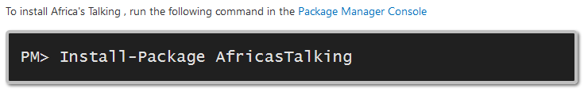
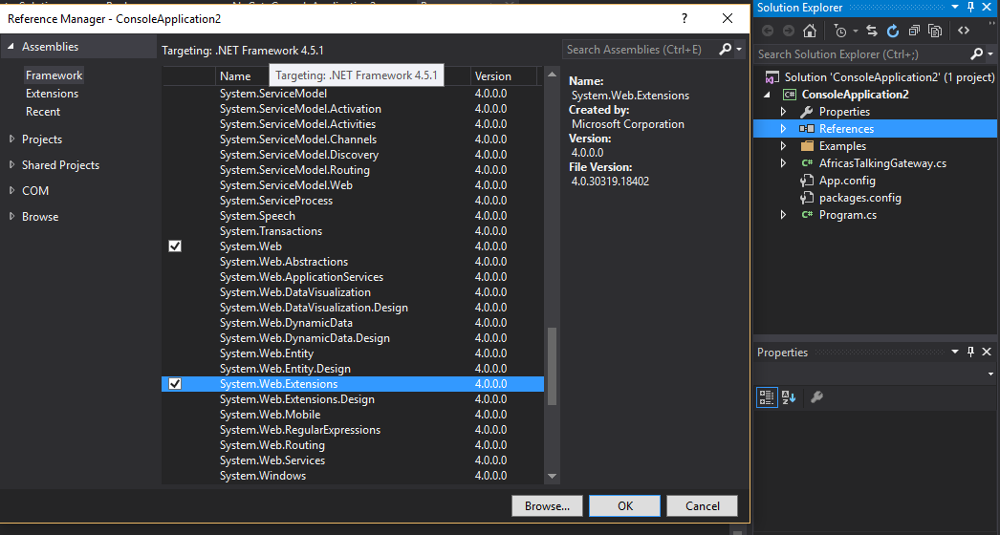

# Africa's Talking C# Gateway  
___ 
  
Official Africa's Talking C# API wrapper  
### Install 
In your Nuget package manager console window enter the following
```BASH 
  Install-Package AfricasTalking 
``` 


To help decode JSON responses, you will need to add a reference in your project reference, add the  ``System.Web`` and ``System.Web.Extensions`` reference    


### Initialization
```csharp        
// Specify your Account credentials
        string username = "MyAfricasTalkingUsername";
        string apiKey   = "MyAfricasTalkingAPIKey"; 
};
```
### [SMS ](http://docs.africastalking.com/sms/sending/csharp)
```csharp
{
    static public void Sendsmg()
    {
        // Specify your login credentials
        string username = "MyAfricasTalkingUsername";
        string apiKey   = "MyAfricasTalkingAPIKey";
        //.....Your business logic
        //all methods return a promise
        try
        {
        //status is either "Success" or "error message"
        // Your business logic ...
        }
       catch (AfricasTalkingGatewayException e)
        {
            Console.WriteLine("Encountered an error: " + e.Message);
        }
        //Do something else...
        Console.Read();
    }
}
```
#### [Sending SMS Sample](http://docs.africastalking.com/sms/sending/csharp)
- `send(options)`: Send a message. `options` contains:
    - `to`: A single recipient or an array of recipients. `REQUIRED`
    - `from`: Shortcode or alphanumeric ID that is registered with Africa's Talking account.
    - `message`: SMS content. `REQUIRED`
- `sendBulk(options)`: Send bulk SMS. In addition to paramaters of `send()`, we would have: 
    - `enqueue`: "[...] would like deliver as many messages to the API before waiting for an Ack from the Telcos."  
- `sendPremium(options)`: Send premium SMS. In addition to paramaters of `send()`, we would have:
    - `keyword`: Value is a premium keyword `REQUIRED`
    - `linkId`: "[...] We forward the `linkId` to your application when the user send a message to your service" `REQUIRED`
    - `retryDurationInHours`: "It specifies the number of hours your subscription message should be retried in case it's not delivered to the subscriber"   
#### [Retrieving SMS](http://docs.africastalking.com/sms/sending/csharp)
> You can register a callback URL with us and we will forward any messages that are sent to your account the moment they arrive. 
> [Read more](http://docs.africastalking.com/sms/callback)
- `fetchMessages(options)`: Manually retrieve your messages.
    - `lastReceivedId`: "This is the id of the message that you last processed". Defaults to `0`. `REQUIRED`
#### [Premium Subscriptions](http://docs.africastalking.com/sms/sending/csharp)
> If you have subscription products on your premium SMS short codes, you will need to configure a callback URL that we will invoke to notify you when users subscribe or unsubscribe from your products.
> [Read more](http://docs.africastalking.com/subscriptions/callback)
- `createSubscription(options)`:
  - `shortCode`: "This is a premium short code mapped to your account". `REQUIRED`
    - `keyword`: "Value is a premium keyword under the above short code and mapped to your account". `REQUIRED`
    - `phoneNumber`: "The phoneNumber to be subscribed" `REQUIRED`
- `fetchSubscription(options)`:
    - `shortCode`: "This is a premium short code mapped to your account". `REQUIRED`
    - `keyword`: "Value is a premium keyword under the above short code and mapped to your account". `REQUIRED`
    - `lastReceivedId`: "ID of the subscription you believe to be your last." Defaults to `0`

### [USSD](http://docs.africastalking.com/ussd)
> Processing USSD requests using our API is very easy once your account is set up. In particular, you will need to:
> - Register a service code with us.
> - Register a URL that we can call whenever we get a request from a client coming into our system.
> Once you register your callback URL, any requests that we receive belonging to you will trigger a callback that sends the request data to that page using HTTP POST.
> [Read more.](http://docs.africastalking.com/ussd)
___ 
## Voice
```csharp
```
- Helpers that will construct proper `xml` to send back to Africa's Taking API when it comes `POST`ing. [Read more](http://docs.africastalking.com/voice)
    - `Say`, `Play`, `GetDigits`, `Dial`, `Record`, `Enqueue`, `Dequeue`, `Conference`, `Redirect`, `Reject`
- Initiate a call
- Fetch call queue
- Any url to ```Play``` will be cached by default.
- Remember to send back an HTTP 200.
#### [Initiate a call](http://docs.africastalking.com/voice/call)
The CSharp code snippet below shows how to make a call using our API
```csharp
class MainClass
{   
    static public void testCalling ()
    {
       // Specify your login credentials
        string username = "MyAfricasTalkingUsername";
        string apiKey   = "MyAfricasTalkingAPIKey";
        // Specify your Africa's Talking phone number in international format
        // Please ensure you include the country code (+254 for Kenya in this case)
        string from = "+254711082XXX";
        // Specify the numbers that you want to call to in a comma-separated list
        string to = "+254711XXXYYY,+254733YYYZZZ";
        // Create a new instance of our awesome gateway class
        AfricasTalkingGateway gateway = new AfricasTalkingGateway (username, apiKey);
        //all methods return a promise
        try {            
                //Only status "Queued" means the call was successfully placed    
                dynamic results = gateway.call(from, to);
                //Your business logic ...    
            }
            Console.WriteLine ("Calls have been initiated. Time for song and dance!");
           } catch (AfricasTalkingGatewayException e) {
            Console.WriteLine ("Encountered an error: " + e.Message);        
        }
          //Do something else...
    }
}
```
___ 
### Airtime
```csharp
class MainClass
{
    static public void Main ()
    {   
         // Specify your login credentials
        string username = "MyAfricasTalkingUsername";
        string apiKey   = "MyAfricasTalkingAPIKey";
        // Specify an array list to hold numbers to receive airtime
        ArrayList AirtimeRecipientsList = new ArrayList();
         // Declare hashtable to hold the first number
         Hashtable rec1      = new Hashtable();
        rec1["phoneNumber"] = "+254711XXXYYY";
        rec1["amount"]      = "KES XXX";
          // Add recipient to list
        AirtimeRecipientsList.Add(rec1);
        //.....You can add as many hashtable as possible
        // Create a new instance of our awesome gateway class
        AfricasTalkingGateway gateway = new AfricasTalkingGateway (username, apiKey);
        //all methods return a promise
     try {
            // That's it. Hit send and we will handle the rest                          
            dynamic response = gateway.sendAirtime(AirtimeRecipientsList);
            //Any other business logic ... 
            }
            catch(AfricasTalkingGatewayException ex) {
                Console.WriteLine (ex.Message);
            }
              //Do something else...
    }
}
```      
___ 
### [ Account Balance](http://docs.africastalking.com/userdata/balance/csharp)
- `FetchAccount()`: Fetch account info; i.e. balance
```csharp
class MainClass
{
    static public void Main ()
     {             
        // Specify your login credentials
        string username = "MyAfricasTalkingUsername";
        string apiKey   = "MyAfricasTalkingAPIKey";
        // Create a new instance of our awesome gateway class
            AfricasTalkingGateway gateway = new AfricasTalkingGateway (username, apiKey);
      // so wrap the call in a try-catch block       
            try {
              dynamic response = gateway.getUserData ();
                Console.WriteLine (response["balance"]);
            //The result will have the format=> KES XXX
            } catch (AfricasTalkingGatewayException e) {
                Console.WriteLine ("Encountered an error: " + e.Message);        
        }
        //Do something else...
    }
}
```
___
### Payments
### C2B
> Mobile Consumer To Business (C2B) functionality allows your application to receive payments that are initiated by a mobile subscriber.
> This is typically achieved by disctributing a PayBill or BuyGoods number (and optionally an account number) that clients can use to make payments from their mobile devices.
> [Read more](http://docs.africastalking.com/payments/mobile-c2b)
```csharp
 class customer2business
    {
        static public void _customer2business()
        {
        // Specify your login credentials
        string username = "MyAfricasTalkingUsername";
        string apiKey   = "MyAfricasTalkingAPIKey";
          // Specify the name of your Africa's Talking payment product
            string productName     = "ATproductName";
            // The phone number of the customer checking out
            string phoneNumber     = "++254711XXXYYY";
            // The 3-Letter ISO currency code for the checkout amount
            string currencyCode    = "KES";
            // The checkout amount
            int amount             = 500;
            // The provider Channel - Optional
            string providerChannel = "your providerChannel";

            // Create a new instance of our awesome gateway class
            AfricasTalkingGateway gateway = new AfricasTalkingGateway(username, apiKey);   
            // Any gateway errors will be captured by our custom Exception class below,        
            try
            {
                // Initiate the checkout. If successful, you will get back a json response
                dynamic checkoutResponse = gateway.initiateMobilePaymentCheckout(productName, phoneNumber,currencyCode,amount,providerChannel);

                Console.WriteLine(checkoutResponse);

            }
            catch (AfricasTalkingGatewayException e)
            {
                Console.WriteLine("Encountered an error: " + e.Message);
            }
            Console.Read();
        }
    }
```
### Initiate checkout

- `checkout(options)`: Initiate Customer to Business (C2B) payments on a mobile subscriber's device. [More info](http://docs.africastalking.com/payments/mobile-checkout)
    - `productName`: Your Payment Product. `REQUIRED`
    - `phoneNumber`: The customer phone number (in international format; e.g. `25471xxxxxxx`). `REQUIRED`
    - `currencyCode`: 3-digit ISO format currency code (e.g `KES`, `USD`, `UGX` etc.) `REQUIRED`
    - `amount`: This is the amount. `REQUIRED`
    - `metadata`: Some optional data to associate with transaction.
```csharp
 class initiatecheckout
    {
        static public void Initiatecheckout()
        {
        // Specify your login credentials
        string username = "MyAfricasTalkingUsername";
        string apiKey   = "MyAfricasTalkingAPIKey";
        //.....Your business logic
        //all methods return a promise              
            try
            {
                //Initiate the checkout. If successful, you will get back a json response
                //Your business logic ... 
              Console.WriteLine(checkoutResponse);
            }
            catch (AfricasTalkingGatewayException e)
            {
                Console.WriteLine("Encountered an error: " + e.Message);
            }
            //Do something else...
            Console.Read();
        }
    }
```
### B2C
- `pay(options)`:  Initiate payments to mobile subscribers from your payment wallet. [More info](http://docs.africastalking.com/payments/mobile-b2c)
    - `productName`: Your Payment Product. `REQUIRED`
    - `recipients`: A list of **up to 10** recipients. Each recipient has:
        - `phoneNumber`: The payee phone number (in international format; e.g. `25471xxxxxxx`). `REQUIRED`
        - `currencyCode`: 3-digit ISO format currency code (e.g `KES`, `USD`, `UGX` etc.) `REQUIRED`
        - `amount`: Payment amount. `REQUIRED`
        - `reason`: This field contains a string showing the purpose for the payment.
        - `metadata`: Some optional data to associate with transaction.
### B2B
 -  ``In order`` to facilitate __Mobile B2C transactions__, we have implemented a RESTFul JSON API that allows your application to request B2C Payments to a mobile subscriber's phone number. The amount specified will then be directly credited to the mobile subscriber's account. Our API allows you to initiate multiple B2C transactions in one request, all of which will be queued in our gateways for processing.
-  ``Once`` the payment provider confirms or rejects the payment request, our APIs will generate a payment notification and send it to the callback URL configured in your account. You can learn more about how to handle payment notifications [in this section](http://docs.africastalking.com/payment/notification).
- ``Please`` note that a notification will be generated regardless of whether the transaction was successful or not. 
```csharp
public class TestMobilePaymentB2C
{
    public static void MobilePaymentB2C()
    {
        // Specify your login credentials
        string username = "MyAfricasTalkingUsername";
        string apiKey   = "MyAfricasTalkingAPIKey";
    //Create an instance of our awesome gateway class and pass your credentials
    AfricasTalkingGateway gateway    = new AfricasTalkingGateway(username, apiKey, "production");
    // Specify the name of your Africa's Talking payment product
        string productName = "My Online Store";
        // The 3-Letter ISO currency code for the checkout amount
        string currencyCode = "KES";
        //Provide the details of a mobile money recipient
        MobilePaymentB2CRecipient recipient1 = new MobilePaymentB2CRecipient("+254700YYYXXX", "KES", 10M);
        recipient1.AddMetadata("name", "Clerk");
        recipient1.AddMetadata("reason", "May Salary");
           // You can provide up to 10 recipients at a time
       MobilePaymentB2CRecipient recipient2 = new MobilePaymentB2CRecipient("+254741YYYXXX", "KES", 10M);
       recipient2.AddMetadata("name", "Accountant");
       recipient2.AddMetadata("reason", "May Salary");
        // Put the recipients into an array
        IList<MobilePaymentB2CRecipient> recipients = new List<MobilePaymentB2CRecipient>();
        recipients.Add(recipient1);
         recipients.Add(recipient2);
    try
        {
            var responses = gateway.MobilePaymentB2CRequest(productName, recipients);
            Console.WriteLine(responses);
        }
        catch (Exception ex)
        {
            Console.WriteLine("Received error response: " + ex.Message);
        }
        Console.ReadLine();
    }
}
```


